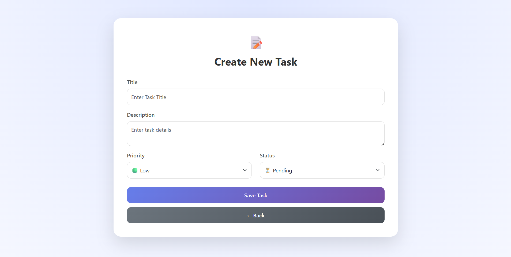
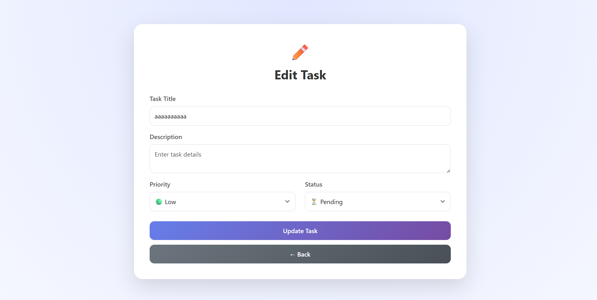

 🗂️ **Laravel Task Management System**

A simple Task Management System built using **Laravel 11, PHP 8+, MySQL, and Bootstrap 5**.  
This project demonstrates CRUD operations, search, filtering, pagination, and clean MVC architecture.

---

## 🚀 Features

- ➕ Create new tasks  
- 📋 View all tasks  
- ✏️ Edit tasks  
- ❌ Delete tasks  
- ✅ Mark tasks as completed  
- 🔍 Search tasks by title  
- 🎯 Filter by priority (Low / Medium / High)  
- 📄 Pagination (5 tasks per page)  
- 🎨 Bootstrap 5 UI  

---

## 🛠️ Tech Stack

- Laravel 11  
- PHP 8.1+  
- MySQL  
- Bootstrap 5  
- Blade Templates  
- Composer  

---

## 📁 Project Structure

app/Http/Controllers/TaskController.php  
app/Models/Task.php  

database/migrations/create_tasks_table.php  

resources/views/tasks/  
- index.blade.php  
- create.blade.php  
- edit.blade.php  

---

## ⚙️ Installation & Setup

### 1. Clone the repository
git clone https://github.com/your-username/task-management-system.git  

---

### 2. Go to project folder
cd task-management-system  

---

### 3. Install dependencies
composer install  

---

### 4. Copy environment file
copy .env.example .env  

---

### 5. Generate application key
php artisan key:generate  

---

### 6. Configure database in .env

DB_CONNECTION=mysql  
DB_HOST=127.0.0.1  
DB_PORT=3306  
DB_DATABASE=task_manager  
DB_USERNAME=root  
DB_PASSWORD=  

---

### 7. Run migrations
php artisan migrate  

---

### 8. Start server
php artisan serve  

---

### 9. Open in browser
http://127.0.0.1:8000/tasks  

---

## 📌 Routes

GET    /tasks                → List tasks  
GET    /tasks/create         → Create form  
POST   /tasks                → Store task  
GET    /tasks/{task}/edit    → Edit task  
PUT    /tasks/{task}         → Update task  
DELETE /tasks/{task}         → Delete task  
PATCH  /tasks/{task}/complete → Mark as completed  

---

## 🧠 Concepts Used

- MVC Architecture  
- Laravel Resource Controllers  
- Eloquent ORM  
- Query Builder (Search & Filter)  
- Form Validation  
- Blade Templates  
- Pagination  
- RESTful APIs basics  

---

## 🔍 Search & Filter

- Search uses LIKE query for task title  
- Filter works using priority (Low / Medium / High)  
- Both can work together  

---

## 📸 Screenshots

### 🏠 Task Dashboard

Displays all tasks with search, filter, pagination, and action buttons.

---

### ➕ Create Task

Create a new task with title, description, priority, and status.

---

### ✏️ Edit Task

Modify existing task information.

---

## 🚀 Future Improvements

- Login/Register system  
- Multi-user task management  
- Due dates & reminders  
- API + React frontend  
- Dashboard analytics  

---

## 👨‍💻 Author

Sushanth  
Aspiring Software Developer | Laravel | Cloud Enthusiast  

---

## 📜 License

This project is for educational and internship assessment purposes.

## About Laravel

Laravel is a web application framework with expressive, elegant syntax. We believe development must be an enjoyable and creative experience to be truly fulfilling. Laravel takes the pain out of development by easing common tasks used in many web projects, such as:

- [Simple, fast routing engine](https://laravel.com/docs/routing).
- [Powerful dependency injection container](https://laravel.com/docs/container).
- Multiple back-ends for [session](https://laravel.com/docs/session) and [cache](https://laravel.com/docs/cache) storage.
- Expressive, intuitive [database ORM](https://laravel.com/docs/eloquent).
- Database agnostic [schema migrations](https://laravel.com/docs/migrations).
- [Robust background job processing](https://laravel.com/docs/queues).
- [Real-time event broadcasting](https://laravel.com/docs/broadcasting).

Laravel is accessible, powerful, and provides tools required for large, robust applications.

## Learning Laravel

Laravel has the most extensive and thorough [documentation](https://laravel.com/docs) and video tutorial library of all modern web application frameworks, making it a breeze to get started with the framework.

You may also try the [Laravel Bootcamp](https://bootcamp.laravel.com), where you will be guided through building a modern Laravel application from scratch.

If you don't feel like reading, [Laracasts](https://laracasts.com) can help. Laracasts contains thousands of video tutorials on a range of topics including Laravel, modern PHP, unit testing, and JavaScript. Boost your skills by digging into our comprehensive video library.
